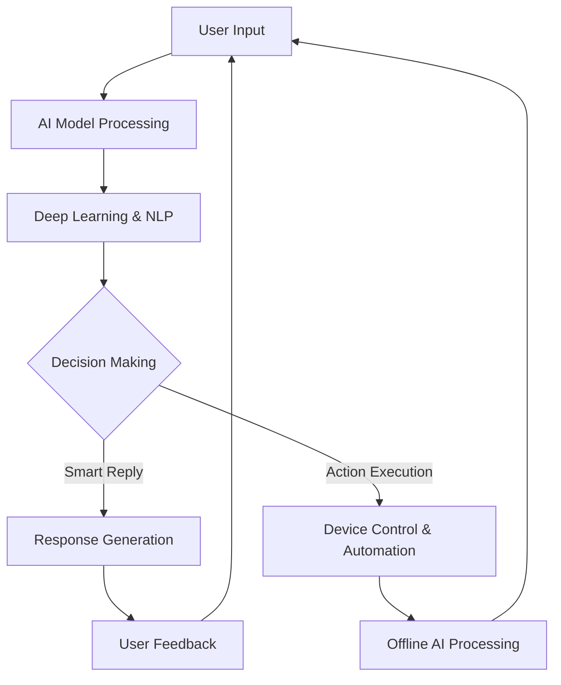

# 🚀 Fasten AI India Industries 🇮🇳  


## 🌟 Welcome to Fasten AI!  

**Fasten AI India Industries** is a cutting-edge AI powerhouse, revolutionizing technology with smart automation, next-gen AI models, and innovative devices. Our mission is to build a future where AI is seamless, powerful, and accessible to everyone! 🌍🤖  

---

## 🔥 Our Vision & Mission 🎯  
✅ **AI for Everyone** - Making AI intuitive & accessible  
✅ **Advanced LLM Development** - Building state-of-the-art AI models 🧠  
✅ **AI-Powered Smart Devices** - Revolutionizing daily life with AI-driven tech 🎧⌚  
✅ **Next-Level Automation** - Automating the world for a better tomorrow ⚡  
✅ **Privacy & Security First** - Your data, your control 🔒  

---

## 🌱 Our Journey: Struggle, Passion, and Innovation

Fasten AI is not just a tech company; it is a vision forged through struggle and perseverance. As the CEO and Co-Founder, **Abdul Hadi**, I embarked on this journey at just 16, balancing my responsibilities as a student while driving Fasten AI toward groundbreaking innovations.

**The Early Days** Starting with limited resources, no coding expertise, and facing financial constraints, I had to learn, adapt, and find ways to make Fasten AI a reality. With determination, I built the foundation, learned AI concepts, and strategized without external funding.

**The Team's Dedication** Each member of my team has faced their own battles. From sleepless nights debugging code to overcoming financial roadblocks, everyone has played a crucial role in shaping Fasten AI. Our **passion for AI and belief in innovation** is what keeps us pushing forward.

**Challenges We Overcame**
* **Financial Struggles** – We lacked investors early on and had to find alternative ways to sustain development.
* **Technical Barriers** – Learning complex AI concepts without formal training was a steep climb.
* **Competing with Giants** – Establishing a new AI company in a world dominated by tech giants wasn't easy.

Yet, despite all these hurdles, Fasten AI stands strong today, ready to disrupt the AI industry with next-level technology.

---

## 🚀 Our Cutting-Edge Products ✨  

### 🔹 **Large Language Model (LLM) with Inbuilt Voice Assistant** 🧠🎙️  
Our upcoming LLM is designed to offer real-time assistance with a seamless voice interface. Experience hands-free AI like never before!  
🔹 **Talk to AI naturally**  
🔹 **Smart contextual understanding**  
🔹 **Multi-language voice interactions**  
🚀 **Coming Soon**  

### 🔹 **Tuesday AI** 💬 - A Grand Comeback Awaits!  
An advanced AI unlike any other. While it's taking a short break, you'll want to stay connected to discover its return.  
🔹 **Stay tuned for its grand comeback!**  
🔹 **Expect the unexpected...**  
🚀 **Coming This Year**  

### 🔹 **AI-Integrated Smartwatches** ⌚ - The Future on Your Wrist!  
These smartwatches are more than just accessories. They hold the power to surprise you. Find out more soon!  
🔹 **Revolutionary features yet to be unveiled...**  
🔹 **What could they do? The answer awaits.**  
🚀 **Coming Soon**  

### 🔹 **Augmented Reality AI Glasses** 🕶️ - A New Dimension of AI!  
Introducing AI-powered AR glasses that blend digital intelligence with real-world vision.  
🔹 **AI-enhanced vision & object recognition**  
🔹 **Real-time navigation & assistance**  
🔹 **Voice-controlled AR interactions**  
🚀 **Coming Soon**  

### 🔹 **AI-Powered Devices** 🎥 - Beyond Imagination!  
A device that goes beyond imagination. Its features are still shrouded in secrecy, but it will be worth the wait.  
🔹 **What lies within? You'll soon find out.**  
🔹 **Prepare to be amazed...**  
🔹 **Hidden functionalities are waiting to be uncovered.**  
🚀 **Coming Soon**  

### 🔹 **Offline AI Smart Devices** 🖥️ - Power Without Internet!  
An AI-powered device that functions entirely offline while maintaining top-tier intelligence and automation.   
🔹 **Smart processing without internet dependency**  
🔹 **Enhanced security & data privacy**  
🔹 **AI-driven automation on the go**  
🚀 **Coming Soon**  

🎉 **More exciting products are coming soon. Stay tuned for future releases!**  

---

## 🌳 AI Architecture Overview  
```
AI Technology Stack
│
├── Large Language Model (LLM)
│   ├── NLP Engine
│   ├── AI Reasoning Core
│   └── Real-time Processing
│
├── Conversational AI
│   ├── Context-Aware Responses
│   ├── Self-Learning Adaptation
│   └── AI Memory Retention
│
├── AI-Integrated Smart Devices
│   ├── Health Monitoring
│   ├── AI-Assisted Features
│   ├── Voice Command Integration
│   ├── Offline Processing Capabilities
│   └── Secure AI Operations
│
└── AI-Powered Systems
    ├── Smart Vision
    ├── Augmented Reality
    ├── AI-Powered Assistance
    ├── Edge Computing
    └── Autonomous AI Interactions
```

---

## 🔄 How Advanced AI Works (Flowchart)  


---

## 🛣️ Roadmap & Upcoming Releases  

### 📅 **Upcoming Releases**  
🟢 **FastenAI 2.5 (April 2025)**  
- Enhanced memory and personalization capabilities  
- Advanced conversation coherence  
- Smarter context retention  

🟡 **FastenAI 3.0 (August 2025)**  
- Optimized AI reasoning and response time  
- Integrated offline AI for smart devices  

🔵 **FastenAI AR Devices (December 2025)**  
- AI-powered smart glasses with real-time overlays  
- Voice-controlled augmented reality  

🔥 **Stay tuned for more updates!**  

---

## 🤝 Community & Contribution  

"Great things are never done by one person. They're done by a team of people."  

We believe in the power of community collaboration. Here's how you can get involved:  

💡 **Share Ideas** - Propose new features or improvements  
🐛 **Report Issues** - Help us identify and fix problems  
🔧 **Contribute Code** - Submit pull requests and help develop new features  
📚 **Documentation** - Help improve our documentation and examples  

### **Join Our Community**  
📢 **GitHub Discussions** - Join active development discussions  
💬 **Telegram Group** - Connect with other AI enthusiasts  
🎯 **Model Focus Areas** - Help shape the future of AI!  

---

## 💡 Why Choose Fasten AI? 🏆  
✅ **Innovative AI Solutions** - Always ahead in AI tech  
✅ **Next-Level LLM Development** - Creating smarter, more efficient models  
✅ **Human-Centric AI** - Designed to enhance everyday life  
✅ **Privacy-Focused** - Full control over your data  
✅ **Offline AI Capabilities** - Smart devices that work anywhere  
✅ **Affordable & Accessible** - AI for everyone  

---

## 📊 Fasten AI vs Others (Comparison Table)  
| Feature              | Fasten AI | Other AI Models |
|----------------------|-----------|----------------|
| Real-Time Processing | ✅ Yes      | ❌ No          |
| Context Awareness   | ✅ Yes      | ⚠️ Limited    |
| Privacy-Focused     | ✅ Yes      | ❌ No          |
| Smart Device Integration | ✅ Yes | ❌ No          |
| Offline AI Support  | ✅ Yes      | ❌ No          |
| Secure Edge Computing | ✅ Yes  | ❌ No |

---

## 👥 About Us & Our Team 🚀  

### Abdul Hadi - CEO & Co-Founder  
CEO and Co-Founder of **Tuesday AI** and **Fasten AI**  

### Ayaaz - Lead Editor  
Leading the editing department  

### Sunny Kumar - Application Development Lead  
Leading the application department (web version and APK)  

### Ujjwal - Web APK Developer  
Responsible for the web versions  

### Rythm Ak Null - Backend Developer  
Leads backend development for the desktop app, optimizes APIs and databases, and consults on web strategy, AI integration, and system scalability.  

### Ruslan - QA & Associate Developer, Product Tester & Designer  
Responsible for debugging, testing, product design, and development. Oversees quality assurance processes to ensure seamless user experiences and designs intuitive product interfaces.  

### Adil - Financial Analyst  
Responsible for financial analysis and strategy  

### King Nish - AI Architecture Lead & Helper  
Assists in designing and optimizing AI architectures  

---

## 📌 Connect With Us! 🌍  
🌐 [Website](http://fastenai.online)  
📢 [Telegram Channel](https://t.me/+CAf2mTWHiqc1Mjll)  
💬 [Telegram Group](https://t.me/fastenaiindia)  
🐦 [Twitter/X](https://twitter.com/Fasten_AI_INDIA)  
📧 [Email](mailto:amohammad80571@gmail.com)  

📢 **Stay Tuned for More AI Innovations!** 🧠⚡
